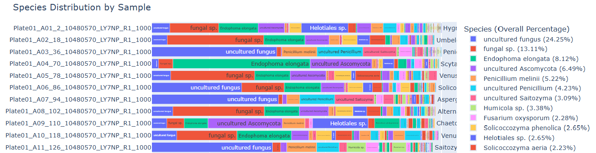

# Species Detector

---

## Description

The Species Detector determines the percentages of species and taxa present in one or more fastq sample files. It is a bash workflow that downsamples reads, classifies them via **BLASTn** against the NCBI *core_nt* database, and compiles an interactive **MultiQC** report summarizing taxonomic composition. The tool is ideal for contamination checks, mixed-species discovery, and rapid QC of sequencing runs.

---

## Prerequisites

* `Bash >= 4`
* `Python >= 3.5`
* Python modules: `os, argparse, pandas, collections, json, Bio, plotly, re`

---

## Requirements / Installation

> **Important:** All paths below assume a Linux cluster environment. Adjust as necessary for your system.

### Copy the NCBI database locally  

The BLAST databases live on a network drive:

```bash
# One-time copy of database and taxonomy files
mkdir -p /workdir/$USER/core_nt
cp /shared_data/genome_db/BLAST_NCBI/core_nt*  /workdir/$USER/core_nt
cp /shared_data/genome_db/BLAST_NCBI/taxdb.*   /workdir/$USER/core_nt
```

### (Optional) Build an mbindex
Building an index speeds up searches but can take several hours:

```bash
export PATH=/programs/ncbi-blast-2.16.0+/bin:$PATH
makembindex -input core_nt -iformat blastdb
```

### Add Species Detector to your PATH:

```bash
export PATH=/programs/fastq_species_detector_multiqc:$PATH
```

### Prepare an output directory:

```bash
mkdir /workdir/HTG_shared/{Date_Instrument_RunNumber_Flowcell}
cd    /workdir/HTG_shared/{Date_Instrument_RunNumber_Flowcell}
```

### Run the script:

```bash
# Point --input_directory to the folder holding FASTQ files
/programs/fastq_species_detector_multiqc/fastq_species_detector_multiqc.sh \
    --input_directory {path to directory containing fastq files to be tested}
```

### For example:
```bash
bash fastq_species_detector_multiqc.sh \
    --run_blast true \
    --read_number "R2" \
    --order_number "10477337" \
    --flowcell_number "HHGHNAFX7" \
    --customer_name "Ann Tate" \
    --customer_email "aef93@cornell.edu" \
    --instrument_type "Unknown" \
    --input_directory "species_detector_testing/Project_10477337" \
    --blast_out_dir "blast_dir" \
    --sort_by "name"
```

---

## Example output 



---

## Update history:

* Version 1.0.0: Initial commit

---

## Full parameter reference:

```sql
USAGE:

    bash fastq_species_detector_multiqc.sh [--run_blast true/false] [--downsample_size downsample_size] 
    [--read_number read_number] [--order_number order_number] [--flowcell_number flowcell_number] 
    [--customer_name customer_name] [--customer_email customer_email] [--instrument_type instrument_type] 
    [--input_directory input_directory] [--scripts_directory scripts_directory] [--blast_out_dir blast_out_dir] 
    [--output_directory current_directory] [--nt_database_directory nt_database_directory] 
    [--nt_database_name nt_database_name] [--sort_by name/topspecies] [--run_adapter_trimming true/false] 
    [--adapter_seq adapter_seq] [--config config_file_name]

OPTIONS:

    --help

        Print this usage information and exit

    --run_blast

        Default: true

        If true, search all subdirectories for fastq files and create BLAST files

    --downsample_size

        Default: 1000

        Ammount to which fastq files are downsampled

    --read_number

        Default: R1

        By entering either R1 or R2 the report will run for any of the possible fastq file name formats:
        If R1 is used, the report will run for any file name ending with _F, .F, .1, _1, _R1_001, .R1_001, _R1, or .R1
        If R2 is used, the report will run for any file name ending with _R, .R, .2, _2, _R2_001, .R2_001, _R2, or .R2

    --order_number

        Default: \"None given\"

        Order number that appears in header of MultiQC report. It is also used as part of the 
        output file name if provided

    --flowcell_number

        Default: \"None given\"

        Flowcell that appears in header of MultiQC report

    --customer_name

        Default: \"None given\"

        Customer name that appears in header of MultiQC report

    --customer_email

        Default: \"None given\"

        Customer email that appears in header of MultiQC report

    --instrument_type

        Default: \"None given\"

        Instrument type that appears in header of MultiQC report

    --input_directory

        Default: current directory

        Location of fastq files. Sub-directories are also included in the search

    --scripts_directory

        Default: \"/lustre2/home/illumina/scripts/munnQC/\"

        Location of python programs, bash scripts, and MultiQC config template used by main script

    --blast_out_dir

        Default: \"blast_out_dir/\"

        Directory where BLAST output files are written

    --nt_database_directory

        Default: \"/workdir/referenceGenomes/blastDBs/core_nt\" or \"/workdir/\$USER/core_nt\" 
        depending upon server being used

        Directory where nt database is located. If database not loaded in either of the default 
        locations the path to the database must be set using this option

    --nt_database_name

        Default: \"core_nt\"

        Name of nt database

    --sort_by

        Default: \"name\"

        Value can either be \"name\", in which case the report sorts alphabetically by sample name, or 
        \"topspecies\", in which case the report sorts samples by the most abundant species

    --run_adapter_trimming

        Default: false

        If true, run adapter trimming

    --adapter_seq

        Default: \"None\"

        Adapter to be used by cutadapt for trimming - must be entered by the user if --run_adapter_trimming is true.
        For example: 
        If TruSeq technology used the adapter should be: AGATCGGAAGAGC
        If Nextera technology used the adapter should be: CTGTCTCTTATACACATCT

    --config

        Default: \"None\"

        Configuration file used to pass parameters to script. Command line parameters take precedence over parameters in config file, 
        which in turn take precedence over defaults in the script. Comment lines (starting with #) and blank lines are ignored. 
        Parameters are set using KEY=value pairs. For example: 

        # Parameters for order 10481131
        run_blast=true
        input_directory=/local/Illumina/DRV/250428_RX_0193_22YJV5LT3
        order_number=10481131
```